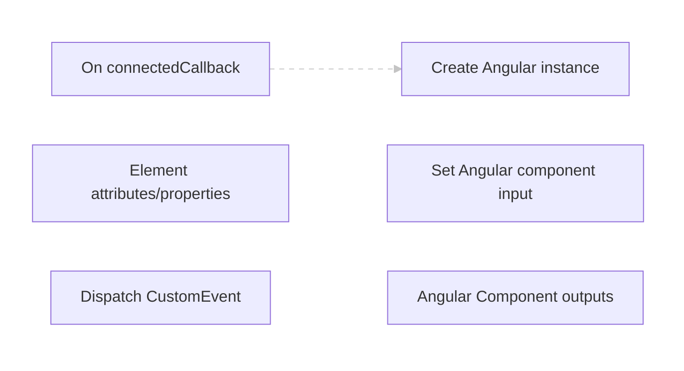
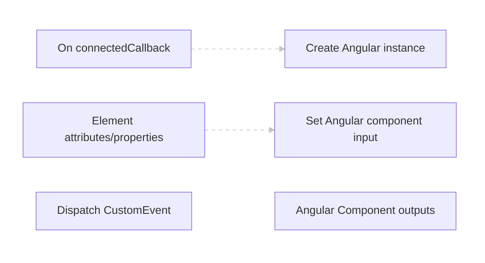
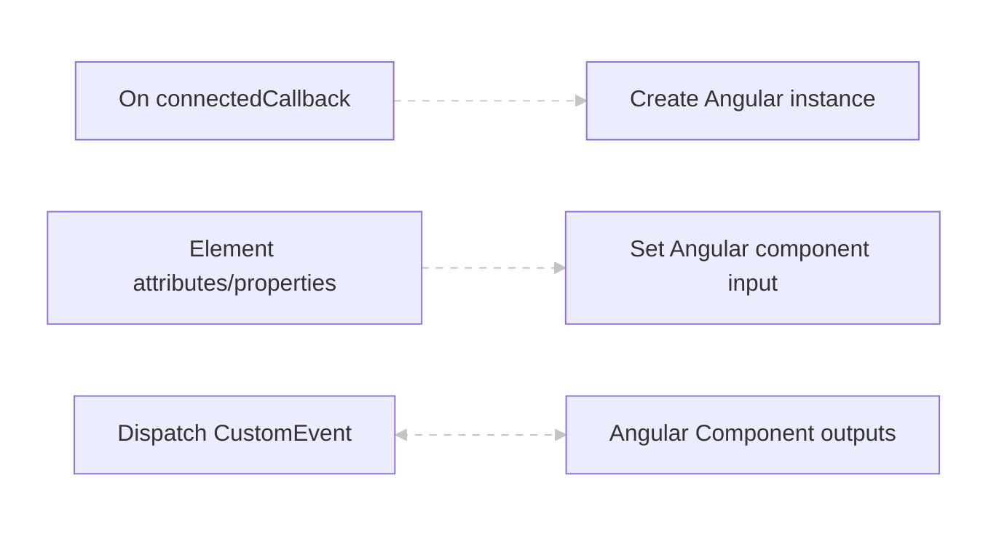
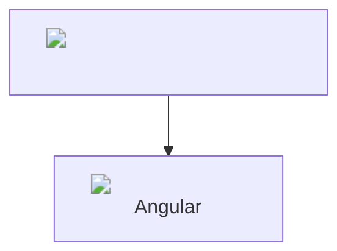
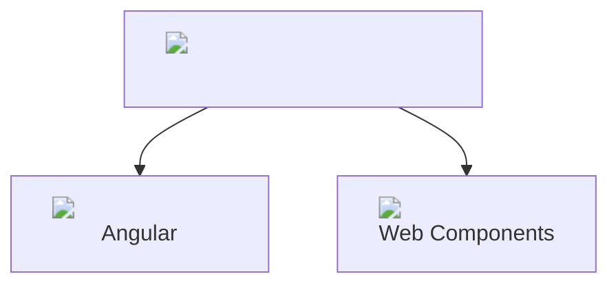
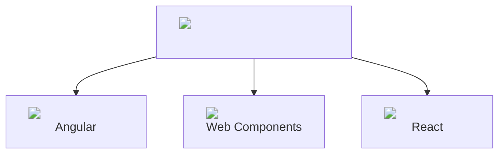
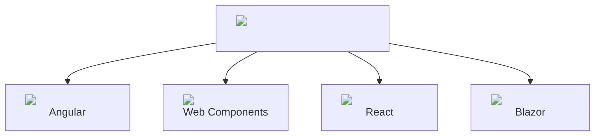

# Taking your Angular [Elements] to go

<br>
<div class="r-hstack justify-around" style="max-height: 50px;">

  <div class="r-hstack">
    
    AngularConnect 2025
  </div>
  

</div>

---

## Hey 👋

<div class="r-hstack">

<div>

 <!-- .element: class="profile-image" -->

Konstantin Dinev
<br>
Director Of Product Development, Infragistics
</div>

<div>

 <!-- .element: class="profile-image" -->

Damyan Petev
<br>
Product Architect, Infragistics

</div>
</div>
---
> 2016 Me: "Zone.JS hooray!"

> And Now: Well... <!-- .element class="fragment" -->

 <!-- .element class="fragment" -->

Note: For context: Presenter image is about as old as a previous presentation given as Angular 2 was just launching that welcomed our new monkey-patching overlord (in light of ye ol' $digest cycle struggles) and has aged like fine.. milk, in the current age of going zoneless :)
---

## What are Angular Elements?

- Angular components packaged as standards-based Web Components (custom elements). <!-- .element class="fragment" -->
- Let you use Angular UI in non-Angular apps (static HTML, plain JS, React, Vue, etc.). <!-- .element class="fragment" -->

---

<!-- .slide: data-auto-animate -->
## Problem

- We have a large Angular component library. <!-- .element class="fragment" -->
- We want to deliver the same components to other frameworks (React, Vue, Blazor, etc.). <!-- .element class="fragment" -->

---

<!-- .slide: data-auto-animate -->
## Options

- Build new components natively for each framework/library. <!-- .element class="fragment" -->
- Build new web components and wrap for the rest of the frameworks. <!-- .element class="fragment" -->
- Reuse the existing Angular components as elements. <!-- .element class="fragment" -->

---

<!-- .slide: data-auto-animate -->
## Why Elements?

We've done the research comparing Elements vs bespoke implementations per framework <!-- .element class="fragment" -->

And the result is clear <!-- .element class="fragment" -->

- 5 years to build all our grids with the features they have in Angular. <!-- .element class="fragment" -->
- 3 years to build 80% of the features. <!-- .element class="fragment" -->
- 6 months and 1/4 of the manpower to wrap the Angular components as Elements. <!-- .element class="fragment" -->


---

<!-- .slide: data-auto-animate -->
## More Benefits

1. Single code base. <!-- .element class="fragment" -->
2. Easier maintenance. <!-- .element class="fragment" -->
3. Reuse of tests. <!-- .element class="fragment" -->

---
## How Angular Elements work


---
## How Angular Elements work


---
## How Angular Elements work


---

<!-- .slide: data-auto-animate -->
## How Angular Elements work

Inside `createCustomElement`:

<pre><code  class="language-typescript" data-line-numbers="2|4,6|9|12,14|19-20">
  class NgElementImpl extends NgElement {

    override attributeChangedCallback(attrName: string, _, newValue: string): void {
      const [propName, transform] = attributeToPropertyInputs[attrName]!;
      this.ngElementStrategy.setInputValue(propName, newValue, transform);
    }

    override connectedCallback(): void {
      // [...]
      if (this.ngElementStrategy.events)
        this.subscribeToEvents();
      // [...]
      this.ngElementStrategy.connect(this);
      // [...]
    }
  }
  // [...]
  inputs.forEach(({propName, transform}) => {
    Object.defineProperty(NgElementImpl.prototype, propName, { ... });
  });
  // [...]
  return NgElementImpl;
</code></pre>

---

<!-- .slide: data-auto-animate -->
## How Angular Elements work

Inside `ComponentNgElementStrategy`:

<pre><code  class="language-typescript" data-line-numbers="8|10-11|13">
  protected initializeComponent(element: HTMLElement) {
    const childInjector = Injector.create({providers: [], parent: this.injector});
    const projectableNodes = extractProjectableNodes(
      element,
      this.componentFactory.ngContentSelectors,
    );
    this.componentRef = this.componentFactory.create(childInjector, projectableNodes, element);

    this.initializeInputs();
    this.initializeOutputs(this.componentRef);

    this.appRef.attachView(this.componentRef.hostView);
    this.componentRef.hostView.detectChanges();
  }
</code></pre>

---

```html
<weather-widget selected-location-name="London"></weather-widget>
```

✨ <!-- .element class="fragment custom current-visible pulse-scale"-->

<weather-widget selected-location-name="London"></weather-widget> <!-- .element class="fragment current-visible" -->

---

<!-- .slide: data-auto-animate -->
## Limitations of Angular Elements

- Child components and declarative structure <!-- .element class="fragment" -->
- Methods & other component API <!-- .element class="fragment" -->
- Templates <!-- .element class="fragment" -->
- Lifecycle reuse <!-- .element class="fragment" -->

---

<!-- .slide: data-auto-animate -->
## How Ignite UI addresses these limitations*

\* to the best of our abilities 😉 <!-- .element class="fragment" -->

---


---

### The Elements Analyzer

<pre><code  class="language-typescript" data-line-numbers="3-4,7|14-15|23-24">
export class Analyzer {
  private checker: ts.TypeChecker;
  private program: ts.Program;

  private get sourceFiles() {
    return this.program.getSourceFiles()
      .filter(file => !file.isDeclarationFile);
  }

  private getComponents(source: ts.NodeArray&lt;ts.Node&gt;) {
    const isComponent = (dec: ts.Decorator) => getDecoratorName(dec) === 'Component';
    return source
      .filter(ts.isClassDeclaration)
      .filter(x => getDecorators(x)!.some(isComponent))
      .map(comp => new AnalyzerComponent(comp, this.checker));
  }
  // [...]
  public async analyze() {
    this.sourceFiles.flatMap(file => this.getComponents(file.statements))
      .forEach(comp => this.configMap.set(comp.name, comp));

    this.resolvedMap = this.resolve();
    await this.printer.run(this.resolvedMap);
  }
</code></pre>
---

### Said Metadata

<pre><code  class="language-typescript" data-line-numbers="4-5|6-7|10|11-12,15|16">
export var registerConfig = [
{
  component: IgxColumnComponent,
  selector: "igc-column",
  parents: [
    IgxGridComponent,
    // [...]
  ],
  contentQueries: [],
  additionalProperties: [
    { name: "selected", writable: true },
    // [...]
  ],
  methods: ["pin", "unpin", "move", "autosize"],
  templateProps: [
    "summaryTemplate",
    "bodyTemplate",
    "headerTemplate",
    "inlineEditorTemplate",
    "errorTemplate",
    "filterCellTemplate",
  ],
  // [...]
</code></pre>

---
<!-- .slide: data-auto-animate -->
### Shopping list

- Handling of child components with:
  - Parent injector structure, so parent-child mechanisms work <!-- .element class="fragment" -->
  - Query updates <!-- .element class="fragment" -->
- Adding methods to prototype <!-- .element class="fragment" -->
- Templates handling <!-- .element class="fragment" --> <aside>(we chose Lit, so Lit➡️TemplateRef)</aside> <!-- .element class="fragment" -->
- Lifecycle modifications inside templates (quite niche) <!-- .element class="fragment" -->

---

### Custom strategy

<pre><code  class="language-typescript" data-line-numbers="2|4|7|9|16|25,30|36|40">
class IgxCustomNgElementStrategy extends* ComponentNgElementStrategy {
  // [...]
  protected override async initializeComponent(element: HTMLElement) {
    // [...]
    const parents: WeakRef<IgcNgElement>[] = [];
    const componentConfig = this.config?.find(x => x.component === this._componentFactory.componentType);

    const configParents = componentConfig?.parents
      .map(parentType => this.config.find(x => x.component === parentType))
      .filter(x => x.selector);

    if (configParents?.length) {
      let node = element as IgcNgElement;
      while (node?.parentElement) {
        node = node.parentElement.closest&lt;IgcNgElement&gt;(configParents.flatMap(x => [
          x.selector,
          reflectComponentType(x.component).selector
        ]).join(','));
        if (node) {
          parents.push(new WeakRef(node));
        }
      }
      // select closest of all possible config parents
      let parent = parents[0]?.deref();

      if (parent?.ngElementStrategy) {
        this.parentElement = new WeakRef(parent);
        let parentComponentRef = await parent?.ngElementStrategy[ComponentRefKey];
        parentInjector = parentComponentRef?.injector;
        // [...]
      }
    }
    // [...]

    const parentQueries = this.getParentContentQueries(componentConfig, parents, configParents);

    for (const { parent, query } of parentQueries) {
      if (query.isQueryList) {
        parent.ngElementStrategy.scheduleQueryUpdate(query.property);
      } else {
        const parentRef = await parent.ngElementStrategy[ComponentRefKey];
        parentRef.instance[query.property] = componentRef.instance;
        parentRef.changeDetectorRef.detectChanges();
      }
    }

    // [...]
    });
  }
  // [...]
</code></pre>

---

```html
<igc-grid id="grid1" width="960px" height="500px" class="ig-scrollbar ig-typography" allow-filtering filter-mode="excelStyleFilter">
  <igc-column field="ProductName" header="Prod. Name" width="180px" sortable has-summary resizable data-type="string"></igc-column>
  <igc-column field="UnitPrice" header="Unit Price" width="180px" sortable has-summary resizable data-type="currency"></igc-column>
  <igc-column field="OrderDate" header="Order Date" width="160px" sortable has-summary resizable data-type="date"></igc-column>
  <igc-column field="UnitsInStock" header="In Stock" width="180px" sortable has-summary resizable data-type="number"></igc-column>
  <igc-column field="UnitsOnOrder" header="On Order" width="180px" sortable has-summary resizable data-type="number"></igc-column>
  <igc-column field="Discontinued" header="Discontinued" width="160px" sortable has-summary resizable data-type="boolean"></igc-column>
</igc-grid>
```
---

<igc-grid id="grid1" width="960px" height="500px" class="ig-scrollbar ig-typography" allow-filtering filter-mode="excelStyleFilter">
  <igc-column field="ProductName" header="Prod. Name" width="180px" sortable has-summary resizable data-type="string"></igc-column>
  <igc-column field="UnitPrice" header="Unit Price" width="180px" sortable has-summary resizable data-type="currency"></igc-column>
  <igc-column field="OrderDate" header="Order Date" width="160px" sortable has-summary resizable data-type="date"></igc-column>
  <igc-column field="UnitsInStock" header="In Stock" width="180px" sortable has-summary resizable data-type="number"></igc-column>
  <igc-column field="UnitsOnOrder" header="On Order" width="180px" sortable has-summary resizable data-type="number"></igc-column>
  <igc-column field="Discontinued" header="Discontinued" width="160px" sortable has-summary resizable data-type="boolean"></igc-column>
</igc-grid>

---

### Custom create element

<pre><code  class="language-typescript" data-line-numbers="7|12|15|18|22-23">
export function createIgxCustomElement(component: Type, config: IgxNgElementConfig): IgxElementConstructor {
  const strategyFactory = new IgxCustomNgElementStrategyFactory(component, config.injector, config.registerConfig);

  guardAttributeNames(strategyFactory);

  const elementCtor = createCustomElement(component, {
    ...config,
    strategyFactory
  });

  const componentConfig = config.registerConfig?.find(x => x.component === component);

  for (const method of componentConfig?.methods) {
    elementCtor.prototype[method] = function() {
      const instance = this.ngElementStrategy.componentRef.instance;
      return this.ngElementStrategy.runInZone(() => 
        instance[method].apply(instance, arguments));
    }
  }

  componentConfig?.additionalProperties.forEach((p) => {
    // Reuse `createCustomElement`'s approach for Inputs, should work for any prop too
  });
  // [...]
</code></pre>


---
```html
<igc-grid id="grid2">
  <igc-column field="ProductName" header="Prod. Name" width="180px" sortable has-summary resizable data-type="string"></igc-column>
  <igc-column field="UnitPrice" header="Unit Price" width="180px" sortable has-summary resizable data-type="currency"></igc-column>
  <!-- ...  -->
</igc-grid>
```
<!-- .element data-line-numbers -->
---
<!-- .slide: data-auto-animate -->
```html
<igc-grid id="grid2">
  <igc-column field="ProductName" header="Prod. Name" width="180px" sortable has-summary resizable data-type="string"></igc-column>
  <igc-column field="UnitPrice" header="Unit Price" width="180px" sortable has-summary resizable data-type="currency"></igc-column>
  <!-- ...  -->
</igc-grid>
<button onclick="grid2.selectColumns(['ProductName','UnitPrice'])">selectColumns(['ProductName','UnitPrice'])</button>
<button onclick="grid2.deselectAllColumns()">deselectAllColumns()</button>
```
<!-- .element data-line-numbers -->
---

<igc-grid id="grid2" width="960px" height="500px" class="ig-scrollbar ig-typography" allow-filtering filter-mode="excelStyleFilter">
  <igc-column field="ProductName" header="Prod. Name" width="180px" sortable has-summary resizable data-type="string"></igc-column>
  <igc-column field="UnitPrice" header="Unit Price" width="180px" sortable has-summary resizable data-type="currency"></igc-column>
  <igc-column id="orderDate" field="OrderDate" header="Order Date" width="160px" sortable has-summary resizable data-type="date"></igc-column>
  <igc-column field="UnitsInStock" header="In Stock" width="180px" sortable has-summary resizable data-type="number"></igc-column>
  <igc-column field="UnitsOnOrder" header="On Order" width="180px" sortable has-summary resizable data-type="number"></igc-column>
  <igc-column field="Discontinued" header="Discontinued" width="160px" sortable has-summary resizable data-type="boolean"></igc-column>
</igc-grid>
<button onclick="grid2.selectColumns(['ProductName','UnitPrice'])">selectColumns(['ProductName','UnitPrice'])</button>
<button onclick="grid2.deselectAllColumns()">deselectAllColumns</button>
---

### Template wrapper

<pre><code  class="language-html" data-line-numbers="2|4|5">
@for (templateFunc of templateFunctions; track templateFunc) {
    <ng-template let-context="context">
        <div #container style="display: contents;"></div>
        {{ litRender(container, templateFunc, context) }}
    </ng-template>
}
</code></pre>

---
```js
import { html } from 'lit';

const inStockColumn = document.getElementById('inStockColumn');
inStockColumn.bodyTemplate = ({ cell: { value }}) =>
  html`${value < 20 ? '⚠️ ' + value : value}`;
```
---
## It's alive!

<igc-grid width="960px" height="500px" class="ig-scrollbar ig-typography" allow-filtering filter-mode="excelStyleFilter">
  <igc-column field="ProductName" header="Prod. Name" width="180px" sortable has-summary resizable data-type="string"></igc-column>
  <igc-column field="UnitPrice" header="Unit Price" width="180px" sortable has-summary resizable data-type="currency"></igc-column>
  <igc-column field="OrderDate" header="Order Date" width="160px" sortable has-summary resizable data-type="date"></igc-column>
  <igc-column id="inStockColumn" field="UnitsInStock" header="In Stock" width="180px" sortable has-summary resizable data-type="number"></igc-column>
  <igc-column field="UnitsOnOrder" header="On Order" width="180px" sortable has-summary resizable data-type="number"></igc-column>
  <igc-column field="Discontinued" header="Discontinued" width="160px" sortable has-summary resizable data-type="boolean"></igc-column>
</igc-grid>

---

## The wishlist

- Lifecycle QoL-s <!-- .element class="fragment" -->
- Packaging <!-- .element class="fragment" -->
- Differential compilation <!-- .element class="fragment" -->
- < insert other minor issues here > <!-- .element class="fragment" -->

---

---

---

---


---

## Giveaway ⏰🥽

 <!-- .element style="width:50%" -->

---
## Questions ❔

 <!-- .element style="width:50%" -->

---

## Thank you!

@DamyanPetev @KonstantinDinev <!-- .element class="fragment" -->


[github.com/IgniteUI/igniteui-angular](https://github.com/IgniteUI/igniteui-angular/tree/master/projects/igniteui-angular-elements) <!-- .element class="fragment" -->
[github.com/damyanpetev/angular-connect-2025](https://github.com/damyanpetev/angular-connect-2025) <!-- .element class="fragment" -->
