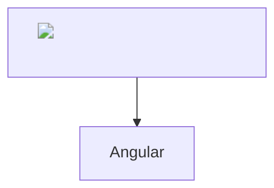
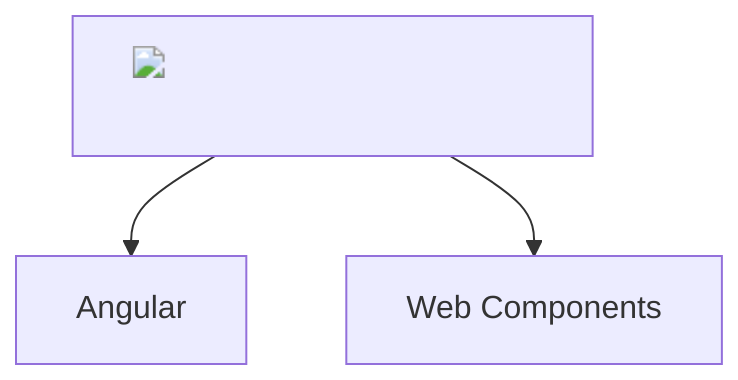
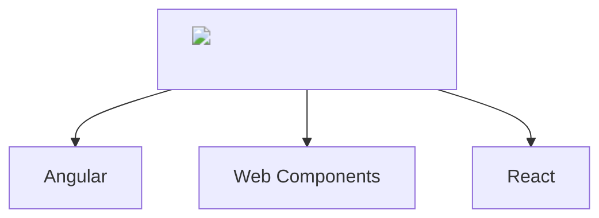
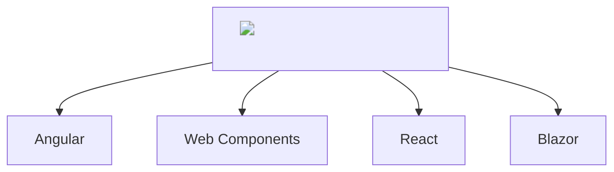

# Taking your Angular [Elements] to go

 

  

    
    AngularConnect 2025
  

  

---

## Hey 👋

 <!-- .element: class="profile-image" -->

Damyan Petev — Product Architect, Infragistics

 <!-- .element: class="profile-image" -->

Konstantin Dinev — Director Of Product Development, Infragistics

---
<!-- .slide: data-auto-animate -->
> 2016 Me: "Zone.JS hooray!"

---
<!-- .slide: data-auto-animate -->
> 2016 Me: "Zone.JS hooray!"

> And Now: Well...

---
<!-- .slide: data-auto-animate -->
> 2016 Me: "Zone.JS hooray!"

> And Now: Well...

Note: For context: Presenter image is about as old as a previous presentation given as Angular 2 was just launching that welcomed our new monkey-patching overlord (in light of ye ol' $digest cycle struggles) and has aged like fine.. milk, in the current age of going zoneless :)
---

## What are Angular Elements?

- Angular components packaged as standards-based Web Components (custom elements). <!-- .element class="fragment" -->
- Let you use Angular UI in non-Angular apps (static HTML, React, Vue, plain JS). <!-- .element class="fragment" -->
- Built using @angular/elements and Angular's compiler to create a Custom Element. <!-- .element class="fragment" -->

---

<!-- .slide: data-auto-animate -->
## Why Elements?

We've done the research comparing Elements vs bespoke implementations per framework <!-- .element class="fragment" -->

And the results clear <!-- .element class="fragment" -->

---

<!-- .slide: data-auto-animate -->
## Why Elements?

- Less initial effort <!-- .element class="fragment" -->
- Single code base -> less perpetual maintenance effort <!-- .element class="fragment" -->

---

<!-- .slide: data-auto-animate -->
## How Angular Elements work

- Wrap an Angular component inside a Custom Element class. <!-- .element class="fragment" -->
- On connectedCallback, Angular bootstraps a small element-specific injector and component factory. <!-- .element class="fragment" -->
- Inputs map to element attributes/properties; outputs become DOM events. <!-- .element class="fragment" -->
- ?? Can lazy-load Angular runtime per element to reduce initial cost. <!-- .element class="fragment" -->

---

<!-- .slide: data-auto-animate -->
## How Angular Elements work

Inside `createCustomElement`:

<pre><code  class="language-typescript" data-line-numbers="4,6|9|12,14|19-20">
  class NgElementImpl extends NgElement {

    override attributeChangedCallback(attrName: string, _, newValue: string): void {
      const [propName, transform] = attributeToPropertyInputs[attrName]!;
      this.ngElementStrategy.setInputValue(propName, newValue, transform);
    }

    override connectedCallback(): void {
      // [...]
      if (this.ngElementStrategy.events)
        this.subscribeToEvents();
      // [...]
      this.ngElementStrategy.connect(this);
      // [...]
    }
  }
  // [...]
  inputs.forEach(({propName, transform}) => {
    Object.defineProperty(NgElementImpl.prototype, propName, { ... });
  });
  // [...]
  return NgElementImpl;
</code></pre>

---

<!-- .slide: data-auto-animate -->
## How Angular Elements work

Inside `ComponentNgElementStrategy`:

<pre><code  class="language-typescript" data-line-numbers="8|10-11|13">
  protected initializeComponent(element: HTMLElement) {
    const childInjector = Injector.create({providers: [], parent: this.injector});
    const projectableNodes = extractProjectableNodes(
      element,
      this.componentFactory.ngContentSelectors,
    );
    this.componentRef = this.componentFactory.create(childInjector, projectableNodes, element);

    this.initializeInputs();
    this.initializeOutputs(this.componentRef);

    this.appRef.attachView(this.componentRef.hostView);
    this.componentRef.hostView.detectChanges();
  }
</code></pre>

---

< ✨ custom element for demo placeholder ✨>

---

<!-- .slide: data-auto-animate -->
## Limitations of Angular Elements

- Child components and declarative structure <!-- .element class="fragment" -->
- Methods <!-- .element class="fragment" -->
- Templates <!-- .element class="fragment" -->
- Lifecycle reuse <!-- .element class="fragment" -->

---

<!-- .slide: data-auto-animate -->
## Limitations of Angular Elements

- Bundle size: includes Angular runtime unless shared or runtime-included via shell. <!-- .element class="fragment" -->
- Change detection: still uses Angular's zone-based CD by default (can use OnPush, manual change detection). <!-- .element class="fragment" -->
- Styling & encapsulation: Shadow DOM optional; styles may leak or require polyfills for older browsers. <!-- .element class="fragment" -->
- Interop quirks: property/attribute conversions, event naming, lifecycle differences. <!-- .element class="fragment" -->

---

<!-- .slide: data-auto-animate -->
## How Ignite UI addresses these limitations

Analyzer and metadata config that enables us to handle:

---

<!-- .slide: data-auto-animate -->
## How Ignite UI addresses these limitations

- Adding methods to prototype
- Handling of child components with: <!-- .element class="fragment" -->
  - Parent injector structure, so parent-child mechanisms work <!-- .element class="fragment" -->
  - Query updates <!-- .element class="fragment" -->
- Templates handling (we chose Lit, so Lit->TemplateRef) <!-- .element class="fragment" -->
- Lifecycle modifications inside templates (quite niche) <!-- .element class="fragment" -->

---

<!-- .slide: data-auto-animate -->
## How Ignite UI addresses these limitations

- Custom create element <!-- .element class="fragment" -->
- Custom strategy (duh) <!-- .element class="fragment" -->

---

<!-- .slide: data-auto-animate -->
## Summary

- Angular Elements let you package Angular UI as Web Components for broad reuse. <!-- .element class="fragment" -->
- Be mindful of bundle size, change detection, styling, and interop. <!-- .element class="fragment" -->
- Libraries like Ignite UI provide tooling and patterns to mitigate these limitations. <!-- .element class="fragment" -->

---

<!-- .slide: data-auto-animate -->
## Summary

---
<!-- .slide: data-auto-animate -->
## Summary

---
<!-- .slide: data-auto-animate -->
## Summary

---
<!-- .slide: data-auto-animate -->
## Summary

---

<!-- .slide: data-auto-animate -->
## Giveaway ⏰

 <!-- .element style="width:50%" -->

---
<!-- .slide: data-auto-animate -->
## Questions ❔

 <!-- .element style="width:50%" -->

---

## Thank you!

@damyanpetev @kdinev <!-- .element class="fragment" -->

[github.com/IgniteUI/igniteui-angular](https://github.com/IgniteUI/igniteui-angular/tree/master/projects/igniteui-angular-elements) <!-- .element class="fragment" -->

Note: Presenter notes — explain why Ignite UI helps with runtime sharing and theming. (Use 's' to view speaker notes)
